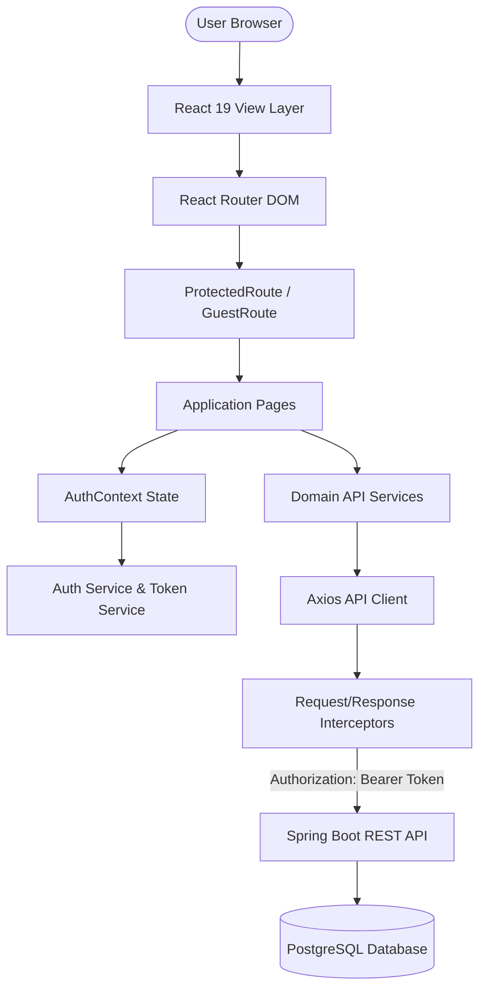
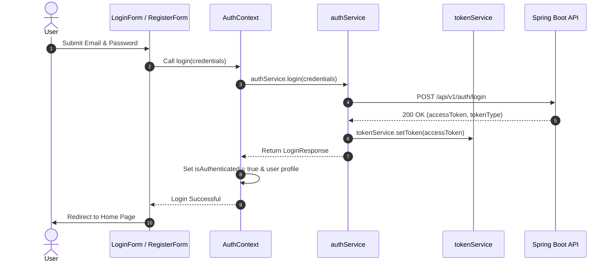

<div align="center">

# AmazonScale Frontend


Enterprise-grade, full-stack connected e-commerce web application inspired by modern large-scale shopping platforms.


</div>

---

## Table of Contents

- [Overview](#overview)
- [Features](#features)
- [Tech Stack](#tech-stack)
- [Architecture](#architecture)
- [Folder Structure](#folder-structure)
- [Authentication Flow](#authentication-flow)
- [Backend Integration](#backend-integration)
- [API Services](#api-services)
- [Environment Variables](#environment-variables)
- [Getting Started](#getting-started)
- [Available Scripts](#available-scripts)
- [Build Output](#build-output)
- [Coding Standards](#coding-standards)
- [Performance](#performance)
- [Security](#security)
- [Roadmap](#roadmap)
- [License](#license)
- [Author](#author)

---

## Overview

**AmazonScale Frontend** is an enterprise-level e-commerce application designed to simulate how production storefronts are architected, structured, and integrated with modern microservices / RESTful backends.

Built with **React 19**, **TypeScript**, **Vite**, and **React Router**, the application is fully wired to a **Spring Boot 3** REST API featuring stateless JWT security, PostgreSQL persistence, and domain-driven service boundaries.

### Project Goals
- **Real-World Architecture**: Model scalable enterprise patterns using clean layer separation (UI -> Context -> Services -> Axios -> REST API).
- **Stateless Authentication**: Implement end-to-end JWT authentication with persistent session state and automatic token injection via Axios interceptors.
- **Production Data Flow**: Replace mock states across all application routes (Catalog, Cart, Wishlist, Orders, Profile) with live Spring Boot API interactions.
- **Type Safety**: Enforce strict TypeScript DTO contracts mirroring backend response models.

---

## Features

### Frontend & UI System
- **React 19 Component Tree**: Built with modern hooks (`useCallback`, `useMemo`, `useState`, `useEffect`).
- **Responsive Layout Shell**: Adaptive Header, Navigation Bar, Sub-header Category Row, and Footer layout.
- **Vanilla CSS Tokens**: Clean design system with zero heavy utility framework overhead.

### Authentication & Authorization
- **JWT Authentication**: Full login (`/api/v1/auth/login`) and registration (`/api/v1/auth/register`) workflows.
- **Persistent Sessions**: Automatic token re-hydration on startup from `localStorage`.
- **Route Guards**: `ProtectedRoute` enforcing authentication for private routes and `GuestRoute` shielding auth pages.

### Backend Integration & Data Synchronization
- **Centralized Axios Client**: Configured with request interceptors for Bearer token injection and response interceptors for global `ErrorResponse` handling.
- **Domain API Services**: Modular TypeScript services encapsulating REST endpoints for Products, Categories, Cart, Wishlist, Orders, and Profile.

### Shopping Experience
- **Live Catalog**: Searchable product grid with brand filtering and stock availability indicators.
- **Product Overview**: Detailed item page with quantity controls, live price calculations, and cart/wishlist triggers.
- **Shopping Cart**: Real-time cart fetching, item quantity modifications, item deletion, cart clearing, and order placement.
- **Wishlists**: Multi-collection support, wishlist creation, item removal, and "Move to Cart" actions.
- **Order Management**: Order tracking with real-time status badges (`PENDING`, `SHIPPED`, `DELIVERED`, `CANCELLED`) and cancellation capabilities.

### Developer Experience & Standards
- **Fast Build Times**: Powered by Vite and ESBuild (production build compiles in ~1.1s).
- **Development Proxy**: Vite dev server proxies `/api` requests to Spring Boot on `http://localhost:8080`.

---

## Tech Stack

### Frontend Core
- **Framework**: React 19 (`react`, `react-dom`)
- **Language**: TypeScript 5.x
- **Build Tool**: Vite 6.x
- **Routing**: React Router DOM (v7)
- **HTTP Client**: Axios 1.x
- **Icons**: Lucide React

### Backend (Integrated Service)
- **Framework**: Spring Boot 3.x / 4.x
- **Security**: Spring Security (Stateless JWT)
- **Database**: PostgreSQL / H2 Database
- **Validation**: Jakarta Validation (`@NotBlank`, `@Email`, `@Size`)

### Development Tools
- **Package Manager**: npm
- **Version Control**: Git & GitHub
- **Code Formatting**: ESLint

---

## Architecture

The AmazonScale frontend relies on a clean, layered architecture separating user interfaces from state providers, API services, and HTTP request logic.



---

## Folder Structure

```text
AmazonScale-Frontend/
├── .env                    # Environment variables (local dev)
├── .env.example            # Sample environment variables template
├── package.json            # Project dependencies and npm scripts
├── vite.config.ts          # Vite configuration and server proxy setup
└── src/
    ├── app/                # App entry point, route definitions, top-level providers
    ├── assets/             # Static logos, icons, and media files
    ├── components/         # Reusable UI components (auth forms, headers, cards)
    ├── context/            # Global React contexts (AuthContext)
    ├── hooks/              # Custom React hooks (useAuth, useLocalStorage)
    ├── layouts/            # Page layout wrappers (MainLayout)
    ├── pages/              # Primary route views (Home, Products, Cart, Wishlist, etc.)
    ├── services/           # Layered API Service modules
    │   ├── api/            # Centralized Axios client & interceptors (apiClient.ts)
    │   ├── auth/           # Auth service & JWT storage (authService.ts, tokenService.ts)
    │   ├── cart/           # Shopping cart service (cartService.ts)
    │   ├── category/       # Category service (categoryService.ts)
    │   ├── order/          # Order management service (orderService.ts)
    │   ├── product/        # Product catalog service (productService.ts)
    │   ├── profile/        # Profile cache management (profileService.ts)
    │   └── wishlist/       # Wishlist service (wishlistService.ts)
    ├── styles/             # Global styles, variables, and CSS design tokens
    └── types/              # TypeScript interface definitions (api.ts, auth.ts)
```

---

## Authentication Flow

AmazonScale uses stateless JWT (JSON Web Token) authentication with persistence.



- **Login**: Sends credentials to `/api/v1/auth/login`. On success, stores the JWT token and parses claims to hydrate user context.
- **Register**: Sends user details to `/api/v1/auth/register`. On success, redirects user to login.
- **Persistent Session**: On app launch, `AuthProvider` verifies local storage for an active token and cached profile.
- **Logout**: Purges JWT token via `tokenService.removeToken()`, resets local profile, and invalidates session state.

---

## Backend Integration

### Axios Client Configuration (`src/services/api/apiClient.ts`)
- **Base URL Resolution**: Defaults to `import.meta.env.VITE_API_BASE_URL || "/api/v1"`.
- **Request Interceptor**: Automatically appends header `Authorization: Bearer <token>` to protected endpoints.
- **Response Interceptor**:
  - Handles **HTTP 401 Unauthorized**: Clears stale tokens and redirects auth context.
  - Parses Spring Boot **`ErrorResponse`** and field validation maps (`400 Bad Request`).
  - Throws typed `ApiError` instances containing HTTP status code, message, and validation details.

---

## API Services

| Service Module | Responsibilities | Endpoints Integrated |
|---|---|---|
| `authService.ts` | User login, user registration, token management | `POST /api/v1/auth/login`<br>`POST /api/v1/auth/register` |
| `productService.ts` | Product catalog retrieval, single product lookup, CRUD | `GET /api/v1/products`<br>`GET /api/v1/products/{id}`<br>`POST /api/v1/products`<br>`PUT /api/v1/products/{id}`<br>`DELETE /api/v1/products/{id}` |
| `categoryService.ts` | Category catalog fetching and management | `GET /api/v1/categories`<br>`GET /api/v1/categories/{id}`<br>`POST /api/v1/categories` |
| `cartService.ts` | Shopping cart operations, quantity adjustments, item removals | `GET /api/v1/cart`<br>`POST /api/v1/cart/items`<br>`PUT /api/v1/cart/items/{id}`<br>`DELETE /api/v1/cart/items/{id}`<br>`DELETE /api/v1/cart` |
| `wishlistService.ts` | Wishlist collections, item management, moving items to cart | `GET /api/v1/wishlists`<br>`GET /api/v1/wishlists/{id}`<br>`POST /api/v1/wishlists`<br>`POST /api/v1/wishlists/items`<br>`PUT /api/v1/wishlists/items/move` |
| `orderService.ts` | Checkout submission, order history, order cancellation | `POST /api/v1/orders`<br>`GET /api/v1/orders`<br>`GET /api/v1/orders/{id}`<br>`PUT /api/v1/orders/{id}/cancel` |
| `profileService.ts` | Local user state cache, profile synchronization | Client-side cache persistence |

---

## Environment Variables

The project uses Vite environment variables defined in `.env`:

```bash
# Base URL for Spring Boot Backend API
VITE_API_BASE_URL=/api/v1
```

### Sample `.env.example`
```bash
# AmazonScale Frontend Environment Variables
VITE_API_BASE_URL=/api/v1
```

---

## Getting Started

### Prerequisites
- **Node.js**: `v18.0.0` or higher
- **npm**: `v9.0.0` or higher
- **Backend**: AmazonScale Spring Boot backend running locally on `http://localhost:8080` (optional, fallback UI states supported).

### Installation & Setup

1. **Clone the repository**:
   ```bash
   git clone https://github.com/Amitgupta0001/amazon-scale-frontend.git
   cd amazon-scale-frontend
   ```

2. **Install dependencies**:
   ```bash
   npm install
   ```

3. **Configure Environment**:
   ```bash
   cp .env.example .env
   ```

4. **Start local development server**:
   ```bash
   npm run dev
   ```
   Open `http://localhost:5173` in your browser.

5. **Run production build**:
   ```bash
   npm run build
   ```

---

## Available Scripts

- `npm run dev`: Starts Vite development server with hot-module replacement (HMR).
- `npm run build`: Executes TypeScript compiler (`tsc -b`) and builds production-optimized assets in `dist/`.
- `npm run preview`: Previews the production build locally.

---

## Build Output

Running `npm run build` compiles the application into the `dist/` directory:

```text
dist/
├── index.html                   # Entry HTML file
├── assets/
│   ├── index-DyffC1HK.css       # Bundled CSS tokens & styles
│   └── index-D4ednsEr.js        # Minified JavaScript bundle (~350 kB)
```

---

## Coding Standards

- **Folder Boundaries**: Features and domain services are organized into distinct folders (`services/[domain]`, `pages/[Page]`, `components/[Feature]`).
- **Naming Conventions**: `PascalCase` for React components/types, `camelCase` for variables, functions, and services.
- **TypeScript**: Strict type definitions mirroring backend DTOs without `any` usage.
- **Component Design**: Functional components leveraging hooks, strict props typing, and semantic HTML elements.

---

## Performance

- **Optimized Bundle**: Built with Vite and Rollup, keeping total bundle size under 360 kB (gzipped ~107 kB).
- **Fast Render Cycles**: Memoized callback definitions (`useCallback`) and derived memo state (`useMemo`) to prevent unnecessary re-renders.
- **Efficient Network Calls**: Async service methods with dedicated loading states across all routes.

---

## Security

- **JWT Storage**: Encapsulated within `tokenService`.
- **Automatic Authorization**: `Authorization: Bearer <token>` header attached to all protected API calls.
- **Protected Routes**: Route guards restrict unauthorized access to sensitive pages (`/cart`, `/wishlist`, `/orders`, `/profile`).
- **Token Invalidation**: Stale or expired tokens are immediately purged on HTTP 401 response.

---

## Roadmap

- [x] **Phase 0** – Project Initialization
- [x] **Phase 1** – React + TypeScript + Vite Setup
- [x] **Phase 2** – Application Shell & MainLayout
- [x] **Phase 3** – Responsive Homepage Component Grid
- [x] **Phase 4** – React Router DOM Route Tree
- [x] **Phase 5** – Authentication UI & Route Guards
- [x] **Phase 6** – Spring Boot REST Backend Integration (Current)
- [ ] **Phase 7** – Advanced Shopping Experience (Search, Pagination, Filters)
- [ ] **Phase 8** – Checkout & Payment Gateway Integration
- [ ] **Phase 9** – Admin Dashboard & Inventory Management
- [ ] **Phase 10** – Production Cloud Deployment & CI/CD Pipeline

---
## License

Distributed under the MIT License. See `LICENSE` for details.

---

## Author

**Amit Kumar Gupta**

- **GitHub**: [@Amitgupta0001](https://github.com/Amitgupta0001)
- **LinkedIn**: [Amit Kumar Gupta](https://www.linkedin.com/in/amitgupta0001/)
- **Portfolio**: [Amit Kumar Gupta](https://amitgupta-resume.vercel.app/)
- **Email**: amitgupta001503@gmail.com
