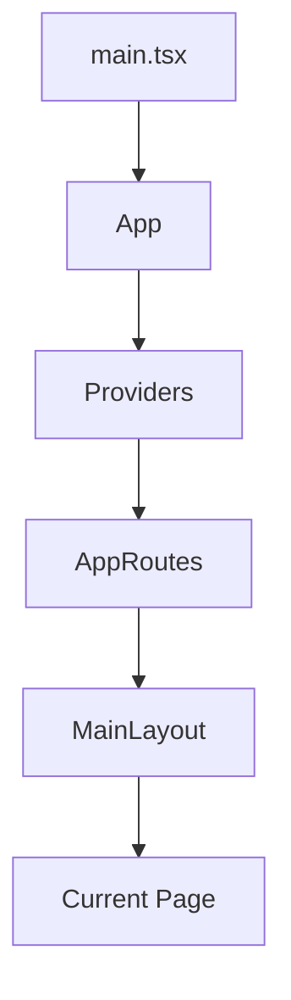

<div align="center">

# AmazonScale Frontend

Enterprise-grade e-commerce frontend inspired by modern large-scale shopping platforms.


</div>

## Table of Contents

- [About The Project](#about-the-project)
- [Features](#features)
- [Tech Stack](#tech-stack)
- [Project Architecture](#project-architecture)
- [Application Flow](#application-flow)
- [Folder Structure](#folder-structure)
- [Routing](#routing)
- [Components](#components)
- [Screenshots](#screenshots)
- [Getting Started](#getting-started)
- [Scripts](#scripts)
- [Development Roadmap](#development-roadmap)
- [Future Improvements](#future-improvements)
- [Contributing](#contributing)
- [License](#license)
- [Author](#author)

## About The Project

AmazonScale Frontend is an enterprise-grade e-commerce frontend application built to simulate how a production web storefront is structured, organized, and maintained.

The project exists to practice and demonstrate modern frontend engineering in a realistic architecture rather than as a tutorial demo. It emphasizes reusable components, route-based layouts, scalable folder organization, and a clean UI system that can support future product, authentication, and commerce features.

### Why It Exists

- To model a real-world e-commerce frontend architecture
- To practice building reusable UI systems with React and TypeScript
- To keep the application organized using production-style folder boundaries
- To prepare the codebase for future expansion into authentication, cart logic, and backend integration

### Learning Goals

- Build an application shell with reusable navigation components
- Structure a frontend project using feature-oriented folders
- Implement layout-based routing with React Router DOM
- Create responsive, accessible, and maintainable UI sections

### Engineering Goals

- Keep the application scalable and production-friendly
- Favor composition over duplication
- Preserve clean component boundaries
- Use semantic HTML and accessible interaction patterns
- Maintain a predictable, easy-to-review codebase

## Features

### Completed

- React 19 + TypeScript + Vite project setup
- Application shell with Header and Footer
- Reusable navigation components
- Responsive homepage
- Hero section
- Category Grid and Category Cards
- Featured Products section
- Product Cards and Product Grid
- Deals section
- Recommendations section
- React Router DOM integration
- Main layout with `Outlet`
- Nested routes
- Dynamic product route
- Working 404 page
- SPA navigation across primary routes
- Professional placeholder pages for core sections

### In Progress

- Product catalog data integration
- Authentication screens and logic
- Cart, wishlist, and orders business behavior
- Backend/API integration

### Planned

- Authorization flows
- Checkout experience
- Payment flow
- State management
- Testing strategy implementation
- Deployment pipeline

## Tech Stack

### Frontend

- React 19
- TypeScript
- Vite
- React Router DOM
- CSS3
- Lucide React

### Development Tools

- Git
- GitHub
- ESLint

### Architecture

- Component-Based Architecture
- Layout-Based Routing
- Feature-Oriented Folder Structure

## Project Architecture

AmazonScale Frontend is organized around a routed application shell and reusable feature modules.

```text
src/
├── app/
├── layouts/
├── pages/
├── components/
├── assets/
├── services/
├── hooks/
├── types/
├── utils/
├── constants/
├── styles/
├── main.tsx
└── index.css
```

### Folder Responsibilities

- `app/` - Application bootstrap, router composition, and top-level providers
- `layouts/` - Shared page shells such as `MainLayout`
- `pages/` - Route-level screens and page-specific component trees
- `components/` - Reusable UI components shared across pages and layouts
- `assets/` - Static assets such as logos, icons, images, and fonts
- `services/` - API clients and service utilities reserved for future backend integration
- `hooks/` - Shared React hooks
- `types/` - Central TypeScript types and interfaces
- `utils/` - Generic utility functions
- `constants/` - Shared constants and configuration values
- `styles/` - Global styles and design tokens

## Application Flow

The application follows a simple routed shell pattern:



### How Routing Works

- `main.tsx` mounts the React application into the DOM
- `App` wraps the application in the shared provider layer
- `Providers` supplies `BrowserRouter`
- `AppRoutes` defines the route tree
- `MainLayout` renders the shared shell with Header, `Outlet`, and Footer
- The current route is rendered inside `Outlet`

## Folder Structure

```text
src/
├── app/
│   ├── App.tsx
│   ├── App.css
│   ├── AppRoutes.tsx
│   └── providers.tsx
├── layouts/
│   └── MainLayout/
├── pages/
│   ├── Home/
│   ├── Products/
│   ├── ProductDetails/
│   ├── Cart/
│   ├── Wishlist/
│   ├── Orders/
│   ├── Login/
│   ├── Register/
│   ├── Profile/
│   ├── Settings/
│   └── NotFound/
├── components/
│   ├── layout/
│   └── navigation/
├── assets/
├── services/
├── hooks/
├── types/
├── utils/
├── constants/
└── styles/
```

### Major Directories

- `app/` contains the application entry composition and routing setup
- `layouts/` contains shared shells and structural wrappers
- `pages/` contains all route targets
- `components/` contains shared UI building blocks
- `assets/` contains static brand and media assets
- `services/`, `hooks/`, `types/`, `utils/`, and `constants/` are reserved for future application growth

## Routing

The following routes are currently configured.

| Route | Description |
| --- | --- |
| `/` | Home page |
| `/products` | Products placeholder page |
| `/products/:productId` | Dynamic product details route |
| `/cart` | Cart placeholder page |
| `/orders` | Orders placeholder page |
| `/profile` | Profile placeholder page |
| `/settings` | Settings placeholder page |
| `/login` | Login placeholder page |
| `/register` | Register placeholder page |
| `*` | Not Found page |

### Routing Notes

- Routes are grouped under `MainLayout` where appropriate
- SPA navigation is used for internal transitions
- The product route accepts a placeholder `productId`
- The wildcard route renders a custom 404 page

## Components

### Header

The Header contains the top-level navigation shell and reusable actions such as Logo, Search Bar, Delivery, Language, Account, Orders, and Cart.

### Footer

The Footer provides supporting navigation, a back-to-top action, and a clean closing section for the application shell.

### Search Bar

The Search Bar is a branded search surface with category selection styling and SPA navigation behavior.

### Hero

The Hero section introduces the homepage with a strong banner, headline, and call-to-action structure.

### Category Grid

The Category Grid presents multiple category cards in a responsive, scan-friendly layout.

### Product Card

The Product Card displays reusable product information, pricing, ratings, badges, and navigation to product details.

### Deals

The Deals section highlights promotional offers and limited-time pricing.

### Recommendations

The Recommendations section shows curated product suggestions in a consistent card grid.

## Screenshots

> Placeholder section for future screenshots.

### Home Page

<!-- Add screenshot here -->

### Products Page

<!-- Add screenshot here -->

### Cart

<!-- Add screenshot here -->

### Login

<!-- Add screenshot here -->

## Getting Started

### Clone

```bash
git clone https://github.com/Amitgupta0001/amazon-scale-frontend.git
cd amazon-scale-frontend
```

### Install

```bash
npm install
```

### Run

```bash
npm run dev
```

### Build

```bash
npm run build
```

## Scripts

```bash
npm run dev
npm run build
npm run preview
```

- `npm run dev` starts the local development server
- `npm run build` creates a production build
- `npm run preview` previews the production build locally

## Development Roadmap

- [x] Phase 0 - Project Initialization
- [x] Phase 1 - React + TypeScript + Vite Setup
- [x] Phase 2 - Application Shell
- [x] Phase 3 - Homepage
- [x] Phase 4 - Routing
- [ ] Phase 5 - Authentication
- [ ] Phase 6 - Backend Integration
- [ ] Phase 7 - Shopping Cart
- [ ] Phase 8 - Checkout
- [ ] Phase 9 - Testing
- [ ] Phase 10 - Deployment

## Future Improvements

- Product catalog data integration
- Search results and filtering behavior
- Authentication flows
- User profile management
- Wishlist and cart persistence
- Order history and order detail views
- API layer and data fetching strategy
- Testing with Vitest and React Testing Library
- CI/CD and deployment automation
- Accessibility and performance audits


## License

This project is licensed under the MIT License.

## Author

**GitHub**: [Amit Kumar Gupta](https://github.com/Amitgupta0001)

**LinkedIn**: [Amit Kumar Gupta](https://www.linkedin.com/in/amitgupta0001/)

**Portfolio**: [Amit Kumar Gupta](https://amitgupta-resume.vercel.app/)

**Email**: amitgupta001503@gmail.com
